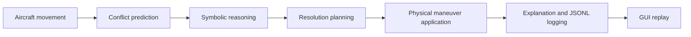

# Abstract

AeroGuard-MAS is a simulated multi-agent airspace conflict management system. Its goal is to model how intelligent agents can detect potential aircraft conflicts, reason about safety constraints, generate resolution plans, apply corrective maneuvers, and explain their decisions.

The system addresses a simplified version of a real airspace management problem: multiple aircraft move through a shared sector while maintaining horizontal and vertical separation. When aircraft trajectories create a current or future loss of separation, the system must detect the unsafe situation and select an appropriate corrective action.

## Core Idea

The core idea is to combine several intelligent-system techniques in a coherent engineering architecture:

- **BDI agents** model high-level responsibilities such as aircraft reporting, sector coordination, conflict detection, resolution planning, and explanation.
- **Symbolic reasoning** with tuProlog evaluates priorities, safety rules, maneuver feasibility, and explanation facts.
- **Planning** generates corrective maneuvers such as climb, descend, slow down, or reroute.
- **Forward simulation** validates that planned maneuvers do not create secondary conflicts.
- **Structured JSONL logging** makes the internal behavior observable.
- **A Python Streamlit GUI** replays the simulation and visualizes aircraft states, conflicts, routes, weather zones, maneuvers, and explanations.

The project is intentionally educational rather than safety-critical. It uses a discrete 2D space, discrete ticks, simplified flight levels, simplified velocities, and configurable separation thresholds. This keeps the system understandable and testable while still demonstrating non-trivial intelligent behavior.

The value of AeroGuard-MAS lies in showing how an intelligent software system can be engineered as a composition of independent, testable components: a domain model, a simulation engine, a symbolic reasoner, a planner, BDI agents, event logging, CLI execution, visualization, and CI/CD automation.
