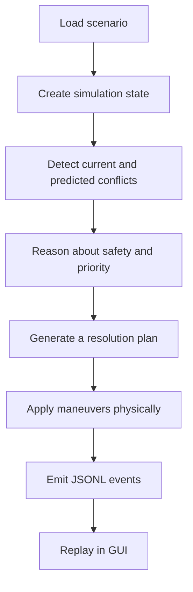
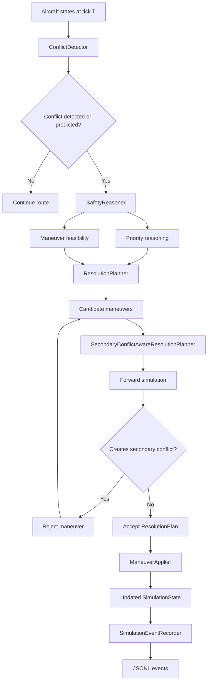
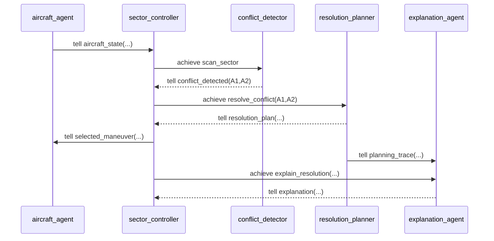
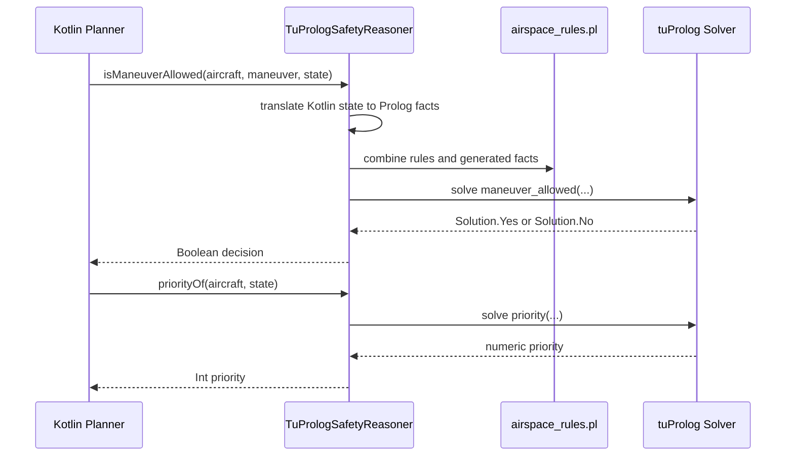
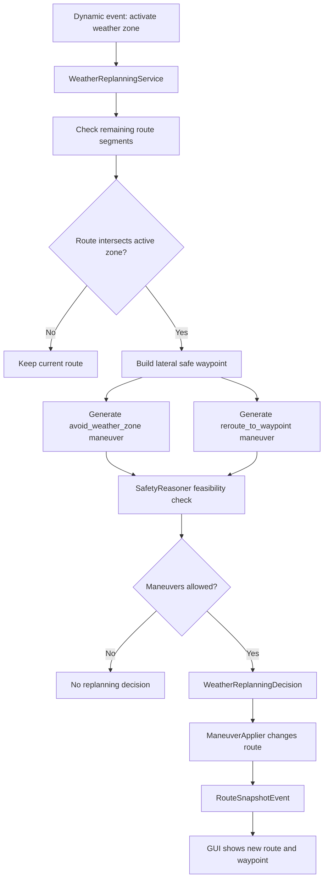
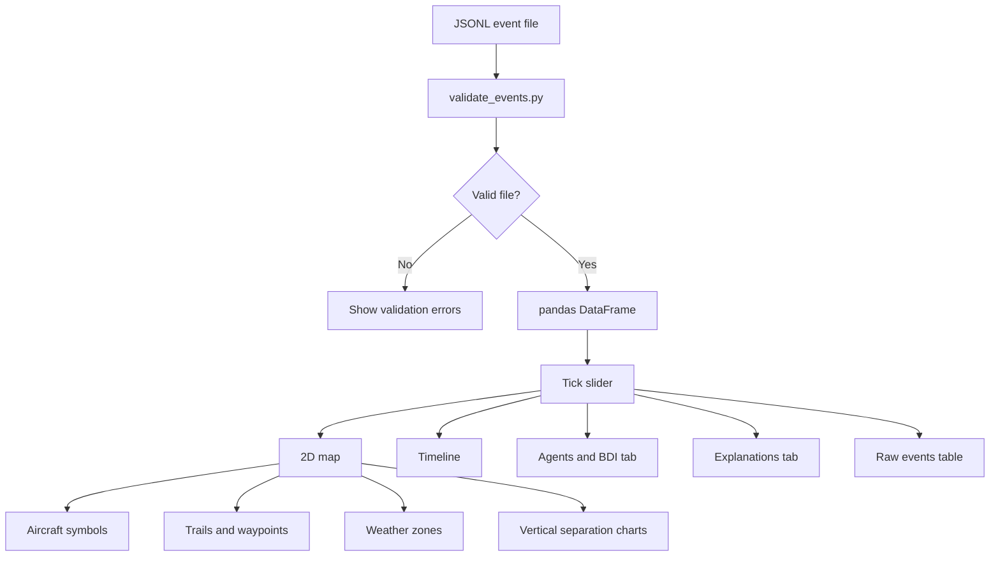

# Code

## Overview

The codebase is organized around the core execution flow:



The most important intelligent behavior is implemented by the interaction between:

- Jason AgentSpeak sources;
- the Prolog safety reasoner;
- the STRIPS-style planner;
- the managed simulation engine;
- the explanation and event layers.

## Intelligent Decision Flow



## Domain Model

The domain model is located in `src/main/kotlin/domain`.

Important classes include:

- `Aircraft`;
- `Position`;
- `FlightLevel`;
- `Velocity`;
- `Waypoint`;
- `Route`;
- `Scenario`;
- `SimulationState`;
- `Conflict`;
- `Maneuver`;
- `ResolutionPlan`;
- `WeatherZone`.

The model is intentionally immutable. For example, when a maneuver changes an aircraft altitude, the system creates a new `Aircraft` object inside a new `SimulationState`.

This supports safer testing and easier reasoning about simulation history.

## Scenario Loading

Scenarios are loaded from JSON by `JsonScenarioLoader`.

The loader:

1. reads a JSON file;
2. decodes it into DTO classes;
3. converts DTOs to validated domain objects;
4. throws `ScenarioLoadingException` on invalid files.

Example scenario structure:

```json
{
  "name": "simple_conflict",
  "maxTicks": 12,
  "separation": {
    "horizontal": 5.0,
    "vertical": 1000
  },
  "aircraft": [
    {
      "id": "AZA123",
      "x": 0.0,
      "y": 0.0,
      "altitude": 30000,
      "speed": 1.0,
      "priority": "normal",
      "emergency": false,
      "route": [
        { "name": "W1", "x": 5.0, "y": 5.0 }
      ]
    }
  ]
}
```

Unknown JSON keys are rejected. This makes scenario files strict and reproducible.

## Simulation Engine

### Aircraft Movement

`AircraftMover` moves each aircraft one tick toward its active waypoint. Movement is based on the aircraft's current position, velocity, and route.

The movement model is simple:

```kotlin
next_position = current_position.stepTowards(active_waypoint, speed)
```

### Conflict Detection

`ConflictDetector` detects unsafe aircraft pairs. It computes:

- horizontal distance;
- vertical distance;
- current conflicts;
- predicted conflicts over a horizon.

A predicted conflict is generated by simulating future aircraft movement and checking separation at each future tick.

### Managed Simulation

`ManagedSimulationEngine` is the main execution orchestrator.

Its responsibilities include:

1. build initial state from scenario;
2. detect current and predicted conflicts;
3. select a conflict for planning;
4. generate a resolution plan;
5. schedule the selected maneuver;
6. advance the simulation tick by tick;
7. apply scheduled maneuvers physically;
8. handle weather replanning events;
9. collect states and conflicts;
10. return a managed run result.

This is the component that connects the intelligent decision layer with the physical simulation.

## Maneuver Application

`ManeuverApplier` applies selected maneuvers to the simulation state.

Examples:

- `CLIMB` changes the aircraft flight level.
- `DESCEND` changes the aircraft flight level.
- `SLOW_DOWN` reduces speed.
- `RESUME_SPEED` restores nominal speed.
- `REROUTE_TO_WAYPOINT` replaces the current route with a new waypoint.
- `AVOID_WEATHER_ZONE` is treated as symbolic unless combined with reroute.

This separation is important: planners decide; the maneuver applier executes.

## Agents

The project includes real Jason / AgentSpeak(L) source files.

The main conceptual agents are:

- `aircraft_agent`;
- `sector_controller`;
- `conflict_detector`;
- `resolution_planner`;
- `explanation_agent`.

### BDI Concepts

The Jason agents expose:

- beliefs;
- goals;
- intentions;
- message passing;
- delegation through `.send(...)`.

The Kotlin class `JasonAgentSmokeAnalyzer` statically analyzes the `.asl` files and extracts observable BDI concepts. This avoids fragile runtime coupling while still ensuring that the project contains real BDI-oriented agent sources.

### Agent Responsibilities

#### Aircraft Agent

Represents aircraft-level reporting. It communicates aircraft state and may report emergency-related facts.

#### Sector Controller Agent

Coordinates the sector. It receives conflict information, delegates scanning or resolution, and communicates selected decisions.

#### Conflict Detector Agent

Represents the role responsible for detecting unsafe aircraft pairs.

#### Resolution Planner Agent

Represents the planning role. It is conceptually responsible for producing resolution actions.

#### Explanation Agent

Represents the explainability role. It produces explanations or receives facts needed to justify system behavior.

## BDI Agent Collaboration



## Prolog Logic

The symbolic reasoning layer is accessed through the `SafetyReasoner` interface.

The tuProlog implementation is `TuPrologSafetyReasoner`.

The reasoner answers questions such as:

```kotlin
fun isConflictUnsafe(conflict: Conflict, state: SimulationState): Boolean
fun isManeuverAllowed(aircraftId: String, maneuver: Maneuver, state: SimulationState): Boolean
fun priorityOf(aircraftId: String, state: SimulationState): Int
fun explainDecision(decisionId: String): List<String>
```

### Facts

The Kotlin layer translates simulation state into Prolog facts. These facts represent aircraft, priorities, emergencies, altitudes, maneuver targets, and separation values.

### Rules

The Prolog theory encodes symbolic rules such as:

- minimum horizontal separation;
- minimum vertical separation;
- emergency priority;
- low-fuel priority;
- valid altitude change;
- maneuver allowed;
- unsafe pair;
- explanation facts.

Exact predicate details are documented in the Prolog source file and comments. If further predicate-level documentation is required, it is **To be completed** in a dedicated Prolog reference page.

## Symbolic Reasoning Interaction



## Planning

The project contains a small STRIPS-style planning implementation.

### STRIPS Concepts

The planning model includes:

- propositions;
- actions;
- preconditions;
- add effects;
- delete effects;
- initial state;
- goal state.

A planning problem is solved by a breadth-first search with bounded depth.

### Resolution Planning

`StripsResolutionPlanner` translates conflicts into candidate maneuver actions. It generates actions such as climb, descend, or slow down, then asks the STRIPS planner to find a sequence that reaches a resolved-conflict goal.

### Secondary Conflict Prevention

`SecondaryConflictAwareResolutionPlanner` improves the basic planning layer.

The problem it addresses is important: a maneuver can solve the primary conflict but create a new conflict with a third aircraft.

Example:

```text
Primary conflict: IBE222 / SAS111
Naive maneuver: climb(SAS111, 32000)
Secondary conflict: SAS111 / EZY333
Safer maneuver: descend(SAS111, 28000)
```

The planner prevents this by:

1. generating candidate maneuvers;
2. checking each maneuver with the symbolic reasoner;
3. applying the maneuver in a simulated future state;
4. advancing the simulation for a prediction horizon;
5. rejecting any maneuver that creates new conflicts;
6. selecting the first safe alternative.

This combines symbolic filtering with forward simulation.

## Weather Replanning

`WeatherReplanningService` handles active weather zones.

When a weather zone becomes active, the service checks whether the remaining route of an aircraft intersects the zone. It does not only check whether a waypoint is inside the zone; it checks route segments against the circular weather area.

If the route is unsafe, it creates a plan with:

- `avoid_weather_zone`;
- `reroute_to_waypoint`.

The safe waypoint is generated laterally relative to the aircraft and weather-zone center, so the aircraft does not continue along a path that crosses the storm.

## Weather Replanning Flow



## Explanation Layer

`ExplanationService` creates readable explanations for:

- no-conflict baseline runs;
- generated resolution plans;
- unresolved conflicts;
- weather replanning decisions.

Explanations are emitted as JSONL events and shown in the GUI.

Example explanation:

```text
STRIPS generated plan 'secondary-safe-predicted-0-4-AZA123-DLH456'
with actions [climb(DLH456,32000)] for conflict 'predicted-0-4-AZA123-DLH456'.
```

The explanation layer is rule-based and deterministic. It does not use an LLM.

## Event Logging

`SimulationEventRecorder` converts simulation results into structured events.

Main event types include:

- `aircraft_state`;
- `route_snapshot`;
- `conflict_detected`;
- `plan_generated`;
- `maneuver_selected`;
- `belief_update`;
- `explanation`;
- `weather_zone_activated`;
- `replanning_triggered`.

Each event is serialized as one JSONL line. This makes the simulation replayable and inspectable.

## GUI Code

The GUI is located in `gui/app.py`.

It performs the following tasks:

1. loads a sample or uploaded JSONL file;
2. validates events;
3. builds a pandas DataFrame;
4. creates a tick slider;
5. renders map, timeline, agents, explanations, and raw event tabs.

The GUI visualizes:

- aircraft as airplane symbols;
- actual trails;
- planned routes;
- waypoints;
- weather zones;
- conflict lines;
- altitude profiles;
- vertical separation profiles;
- BDI traces;
- explanation messages.

The helper `_arrow_safe_dataframe` converts complex JSON values to strings before passing them to Streamlit. This prevents PyArrow serialization errors when columns mix scalar values and lists.

## GUI Replay Flow



## CLI Execution Flow

The CLI entry point is `AeroGuardCli.kt`.

It:

1. parses command-line options;
2. runs Jason source smoke analysis;
3. loads a JSON scenario;
4. initializes the tuProlog reasoner;
5. runs the managed simulation;
6. prints summaries;
7. generates explanations;
8. writes JSONL events.

Example:

```bash
./gradlew run --args="--scenario scenarios/weather_replanning.json --events build/aeroguard/events/weather_replanning_events.jsonl --explain"
```
