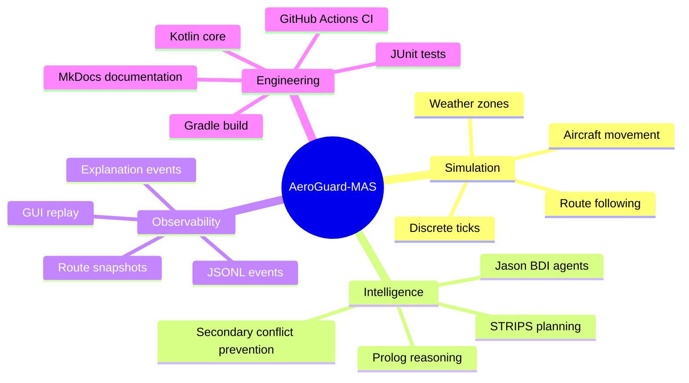

# Conclusion

AeroGuard-MAS demonstrates how a simulated intelligent airspace conflict manager can be engineered using modular software architecture and multiple AI-oriented techniques.

The project achieves the following:

- models a simplified airspace domain;
- loads aircraft scenarios from JSON;
- simulates aircraft movement over discrete ticks;
- detects current and predicted conflicts;
- evaluates symbolic safety rules with tuProlog;
- models BDI agents with real Jason AgentSpeak files;
- generates corrective plans with a STRIPS-style planner;
- prevents secondary conflicts through forward simulation;
- supports weather-zone replanning;
- applies maneuvers physically to the simulation state;
- emits structured JSONL events;
- visualizes behavior through a Streamlit GUI;
- explains decisions through deterministic explanation events;
- validates the system with automated tests;
- runs CI/CD on multiple operating systems.

## Achieved Capabilities

## Strengths

The main strength of the project is its separation of concerns. Each component has a clear role:

- domain objects represent the airspace model;
- the simulation engine advances state;
- the conflict detector identifies unsafe conditions;
- the reasoner handles symbolic safety and priority;
- the planner chooses corrective maneuvers;
- the maneuver applier changes the physical state;
- the event recorder exposes behavior;
- the GUI visualizes the run without controlling it.

This design makes the project understandable, testable, and suitable for a university intelligent systems engineering exam.

Another strength is observability. The JSONL event stream allows users to inspect not only the final result, but also the intermediate reasoning and planning artifacts that led to it.

## Lessons Learned

The project highlights several important lessons:

1. Intelligent behavior requires both decision-making and state application.
   A plan is not enough unless its maneuvers are physically applied to future simulation states.

2. Resolving one conflict can create another.
   Secondary conflict prevention is necessary even in a simplified airspace model.

3. Explanation should be designed into the system.
   Structured events make it easier to explain what happened and why.

4. GUI logic should not replace core logic.
   Keeping the GUI as a viewer preserves architectural clarity.

5. Symbolic reasoning and simulation complement each other.
   Prolog rules are useful for constraints and priorities, while forward simulation is useful for predicting consequences.

## Current Limitations

The system is intentionally simplified. Current limitations include:

- simplified 2D geometry;
- instantaneous altitude changes;
- simplified velocity model;
- limited STRIPS search space;
- lightweight Jason runtime integration;
- no live Kotlin-Python communication;
- no real aviation data feed;
- no certified safety guarantees;
- limited weather modeling;
- limited scalability analysis.

These limitations are acceptable for the educational scope, but they define clear directions for future work.

## Future Developments

### Architectural Improvements

Future versions could introduce:

- clearer bounded contexts;
- richer interfaces between agents and the simulation core;
- dependency injection for easier test configuration;
- more explicit event schemas;
- versioned JSONL contracts.

### Better Reasoning Capabilities

The Prolog layer could be extended with:

- richer altitude constraints;
- sector-entry rules;
- emergency handling rules;
- weather severity reasoning;
- aircraft performance constraints;
- explanation predicates tied directly to each selected rule.

### More Advanced Agents

Jason integration could evolve from source-level smoke validation to runtime interaction. Agents could:

- receive beliefs from the simulation;
- request conflict scans;
- negotiate maneuvers;
- exchange explanations;
- update intentions dynamically.

### Improved Planning

The planner could be improved with:

- A* search;
- cost-based maneuver selection;
- multi-step route planning;
- holding-pattern planning;
- better weather avoidance;
- explicit multi-agent coordination;
- plan repair instead of full replanning.

### Improved Testing

Testing could be extended with:

- property-based tests;
- golden JSONL replay files;
- formal rule tests for Prolog;
- GUI interaction tests;
- mutation testing;
- coverage reporting;
- stress tests with many aircraft.

### Extended CI/CD

CI/CD could be extended to:

- publish test reports;
- generate and publish KDocs;
- generate and publish MkDocs documentation;
- upload demo JSONL artifacts;
- run Python GUI tests;
- verify formatting for Python and Markdown;
- deploy documentation automatically to GitHub Pages.

### Better Deployment Strategy

The project could provide:

- a packaged CLI distribution;
- a Docker image;
- hosted documentation;
- hosted Streamlit demo;
- release artifacts with sample scenarios and generated events.

## Final Assessment

AeroGuard-MAS successfully combines software engineering and intelligent systems concepts in a coherent project. It demonstrates BDI modeling, symbolic reasoning, automated planning, explainability, simulation, visualization, and CI/CD within a manageable scope.

The result is not a real air traffic control system, but it is a strong educational prototype for understanding how intelligent decision-making components can be engineered, tested, observed, and explained.
