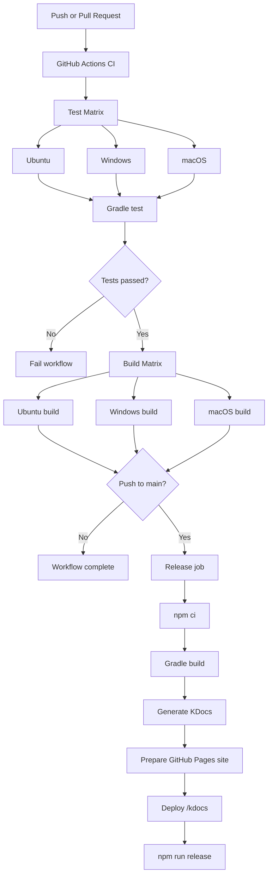
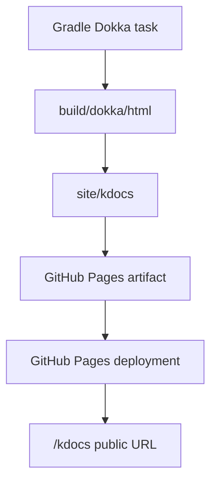
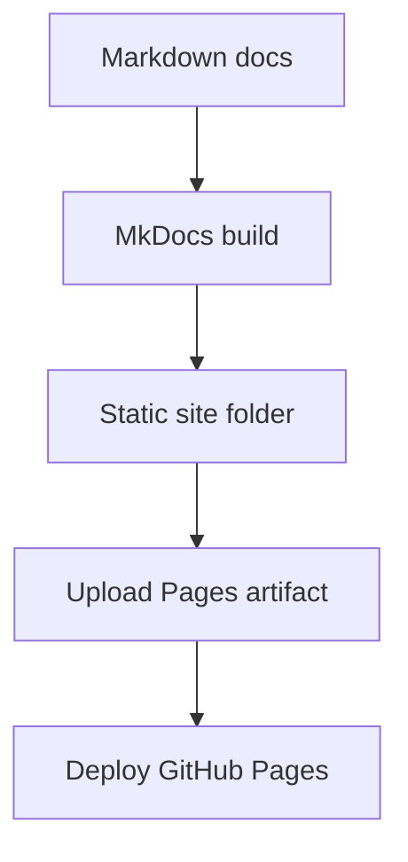

# Deployment

## Overview

AeroGuard-MAS uses GitHub Actions for continuous integration and release automation. The CI/CD pipeline improves reliability by validating the project on every push and pull request.

The project is primarily a command-line and local GUI application. Deployment currently means:

- building the Kotlin/JVM project;
- running automated tests;
- preparing release automation on `main`;
- optionally generating and publishing documentation;
- running the GUI locally from the `gui` directory.

## GitHub Actions Workflow

The CI workflow is defined in:

```text
.github/workflows/ci.yml
```

It contains three main jobs:

1. `test`;
2. `build`;
3. `release`.

## CI/CD Pipeline



## Workflow Triggers

The workflow runs on:

```yaml
on:
  pull_request:
  push:
```

This means tests and builds run for both pull requests and pushes.

The release job runs only when:

```yaml
github.event_name == 'push' && github.ref == 'refs/heads/main'
```

So releases are restricted to pushes on the `main` branch.

## Concurrency

The workflow uses concurrency:

```yaml
concurrency:
  group: ${{ github.workflow }}-${{ github.ref }}
  cancel-in-progress: true
```

This cancels older runs on the same branch when a new commit is pushed. It reduces wasted CI time and avoids outdated results.

## Test Job

The `test` job runs on a matrix of operating systems:

- Ubuntu 24.04;
- Windows 2025;
- macOS 26.

For each OS, it:

1. checks out the repository;
2. sets up Java using Temurin;
3. enables Gradle caching;
4. makes the Gradle wrapper executable on Unix-like systems;
5. runs:

```bash
./gradlew test --no-daemon
```

On Windows it uses:

```powershell
.\gradlew.bat test --no-daemon
```

This validates the project across platforms.

## Build Job

The `build` job depends on `test`.

It runs on the same OS matrix and executes:

```bash
./gradlew build --no-daemon
```

The build job verifies that the project compiles, tests pass during build, and Gradle tasks are correctly configured.

## Release Job

The release job runs only on Ubuntu and only after the build matrix succeeds.

It performs:

1. checkout with full history;
2. Java setup;
3. Node setup;
4. `npm ci`;
5. Gradle build;
6. optional documentation generation;
7. release command:

```bash
npm run release
```

The workflow sets:

```yaml
GITHUB_TOKEN: ${{ secrets.GITHUB_TOKEN }}
HUSKY: 0
```

This indicates that release automation likely uses a Node-based release tool. The exact package and release strategy are **To be completed** from `package.json`.

## Documentation Deployment

The project can generate Kotlin API documentation with Dokka and publish it to GitHub Pages.

A typical documentation deployment flow is:



The target documentation URL is:

```text
https://alextesta00.github.io/aeroguard-mas/kdocs/
```

If this has not yet been merged into the repository, the final deployment status is **To be completed**.

## MkDocs Documentation Deployment

MkDocs can also be built as a static site:

```bash
pip install -r requirements-docs.txt
mkdocs build
```

A future CI job could publish the generated `site/` directory to GitHub Pages.



## Local Deployment

### Kotlin CLI

Run a scenario locally:

```bash
./gradlew run --args="--scenario scenarios/simple_conflict.json --events build/aeroguard/events/simple_conflict_events.jsonl --explain"
```

### Python GUI

Run the GUI locally:

```bash
cd gui
python -m venv .venv
source .venv/bin/activate
pip install -r requirements.txt
streamlit run app.py
```

Windows:

```powershell
cd gui
python -m venv .venv
.venv\Scripts\activate
pip install -r requirements.txt
streamlit run app.py
```

## Why CI/CD Matters

The workflow improves the project by:

- preventing broken code from being merged;
- validating multiple operating systems;
- enforcing repeatable builds;
- supporting release automation;
- enabling documentation publishing;
- increasing confidence before demos or exams.

## Current Limitations

- No Docker packaging is currently documented.
- The GUI is not deployed as a hosted application.
- Release automation details depend on the Node configuration and are **To be completed**.
- KDocs publishing depends on GitHub Pages configuration.
- No binary distribution strategy is documented yet.

## Future Deployment Improvements

Possible improvements include:

- publish generated JSONL demo artifacts;
- publish MkDocs documentation;
- deploy the Streamlit GUI as a hosted demo;
- package the Kotlin CLI as a runnable distribution;
- add coverage reports to CI;
- upload test reports as CI artifacts;
- generate sample events automatically during release;
- publish Dokka and MkDocs under separate paths.
