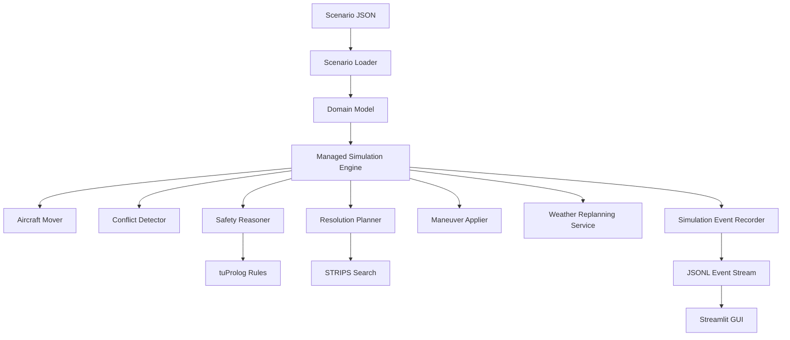
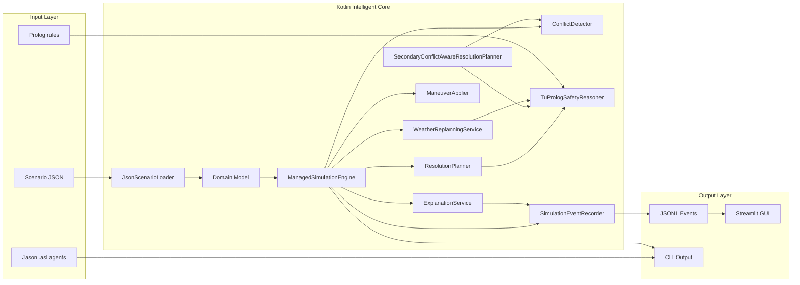
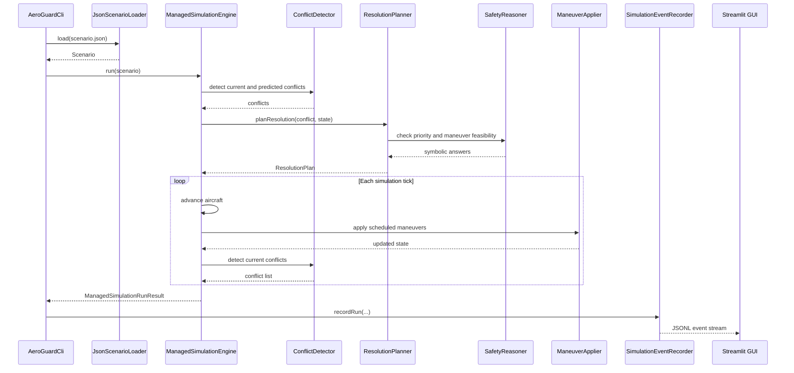

# Design

## Architectural Overview

AeroGuard-MAS is designed as a modular, layered system. Each layer has a clear responsibility and communicates through explicit domain objects or structured events.

The intelligent behavior is located in the Kotlin/Jason/tuProlog/STRIPS core. The Python GUI is deliberately a replay viewer and does not contain decision-making logic.

## Architecture Diagram

## Main Components

### Domain Layer

The domain layer defines immutable data structures such as:

- `Aircraft`;
- `Position`;
- `FlightLevel`;
- `Velocity`;
- `Waypoint`;
- `Route`;
- `Scenario`;
- `SimulationState`;
- `Conflict`;
- `Maneuver`;
- `ResolutionPlan`;
- `WeatherZone`.

This layer contains validation rules close to the data they protect. For example, aircraft identifiers must not be blank, routes must contain at least one waypoint, and flight levels must be non-negative.

### Integration Layer

The integration layer loads external resources:

- JSON scenarios through `JsonScenarioLoader`;
- Jason AgentSpeak sources through `JasonAgentCatalog`;
- Prolog theory resources through the reasoner.

The JSON scenario loader uses explicit DTOs and converts them to domain objects. Unknown JSON keys are rejected, which keeps scenarios predictable and reproducible.

### Simulation Layer

The simulation layer advances the world tick by tick.

Important classes include:

- `AircraftMover`;
- `ConflictDetector`;
- `SimulationEngine`;
- `ManagedSimulationEngine`;
- `ManeuverApplier`;
- `ScheduledManeuver`.

The baseline `SimulationEngine` advances aircraft and detects conflicts. The `ManagedSimulationEngine` integrates intelligent decisions into the loop: it detects conflicts, asks a planner for a resolution, applies maneuvers physically, triggers weather replanning, and returns the resulting simulation states.

### Reasoning Layer

The reasoning layer is represented by the `SafetyReasoner` interface and implemented with tuProlog.

It answers questions such as:

- is this conflict unsafe?
- is this maneuver allowed?
- what is the priority of this aircraft?
- what explanation facts support this decision?

The interface isolates the Kotlin core from Prolog-specific details.

### Planning Layer

The planning layer contains:

- a generic STRIPS problem representation;
- a minimal breadth-first STRIPS planner;
- a resolution planner that maps conflicts to maneuver plans;
- a secondary-conflict-aware planner.

The secondary-conflict-aware planner improves safety by simulating candidate maneuvers forward and rejecting those that create new conflicts with other aircraft.

### Replanning Layer

The weather replanning service handles dynamic weather constraints. When a weather zone becomes active, it checks whether aircraft routes intersect the forbidden area. If so, it generates a reroute plan toward a lateral safe waypoint.

### Events Layer

The events layer converts internal simulation facts into JSONL events. Event types include:

- aircraft state;
- route snapshot;
- conflict detected;
- plan generated;
- maneuver selected;
- belief update;
- explanation;
- weather zone activated;
- replanning triggered.

The event stream is the contract between the intelligent core and the GUI.

### GUI Layer

The GUI is implemented with Streamlit. It loads JSONL files, validates them, and renders:

- a 2D airspace map;
- aircraft symbols;
- route trails;
- route snapshots and waypoints;
- weather zones;
- conflicts;
- altitude profiles;
- vertical separation profiles;
- BDI traces;
- explanations;
- raw events.

The GUI does not perform reasoning or planning.

## Managed Simulation Loop

## Design Decisions

### Immutable Domain Model

Most domain objects are immutable. This reduces hidden side effects and makes tests easier to reason about. Simulation steps create new states rather than modifying existing ones.

### Interface-Based Reasoning

`SafetyReasoner` isolates symbolic reasoning from the rest of the code. This makes it possible to replace or test the reasoning layer without rewriting simulation or planning code.

### Event-Driven Observability

The system emits structured JSONL events instead of relying only on console logs. This supports:

- GUI replay;
- debugging;
- test assertions;
- explanation;
- reproducible demos.

### Replay-Based GUI

The GUI reads generated event files instead of communicating live with the core. This was chosen because it is simpler, robust, and suitable for an exam demo. It also keeps decision-making out of Python.

### Progressive Integration of Jason

Jason agents are represented as real `.asl` files and validated through smoke analysis. The current integration focuses on source-level BDI concepts and message passing rather than a fragile runtime coupling.

### Secondary Conflict Prevention

A naive maneuver can resolve one conflict while creating another. The secondary-conflict-aware planner addresses this by forward-simulating candidate maneuvers and rejecting unsafe alternatives.

## Strengths

- Clear separation of domain, simulation, reasoning, planning, logging, and GUI.
- Testable architecture.
- Explicit symbolic reasoning interface.
- Real JSON scenarios and JSONL event output.
- Real Jason AgentSpeak files.
- Prolog rules stored as project resources.
- GUI makes decisions explainable and observable.
- CI/CD validates the project on multiple operating systems.

## Limitations

- The simulation is not physically realistic.
- Climb and descend are applied instantaneously.
- Jason integration is currently lightweight and source-smoke oriented.
- The GUI is replay-based, not real-time.
- The planner is intentionally small and not optimized for large search spaces.
- Prolog reasoning is scoped to simplified symbolic constraints.
- Weather rerouting uses simplified geometry.
- Dynamic emergency events are present in the domain, but deeper runtime behavior may require further development.

## Rationale

The architecture prioritizes clarity, testability, and didactic value. It demonstrates the engineering of intelligent systems without making the project too large for an individual university assignment. Each major intelligent concept is present in a concrete, inspectable form:

- agents through Jason files;
- symbolic reasoning through Prolog;
- planning through STRIPS-style search;
- explainability through structured explanations;
- observability through JSONL events;
- visualization through Streamlit replay.
