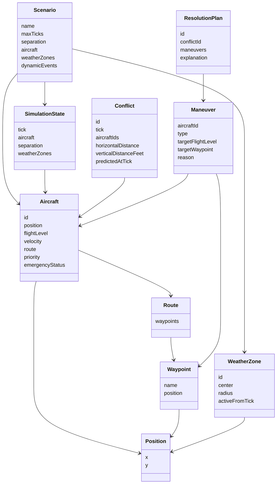
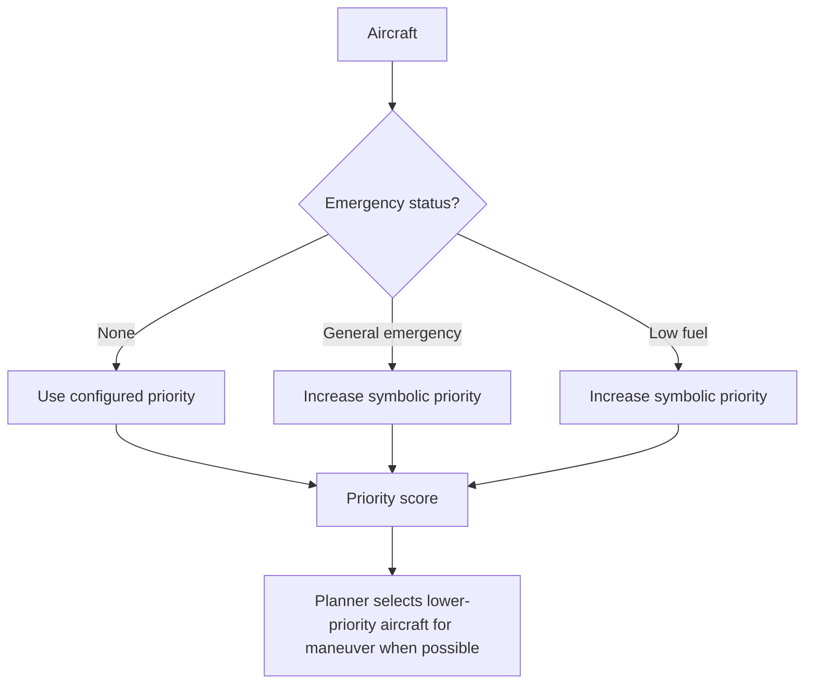

# Domain

## Overview

AeroGuard-MAS operates in a simplified airspace domain. The domain models aircraft moving through a two-dimensional sector while maintaining minimum separation constraints. The simulation is discrete: time advances in ticks, aircraft move toward waypoints, and safety checks are performed at each step.

The project does not model real aviation physics or certified air traffic control procedures. Instead, it abstracts the domain into a compact form suitable for intelligent-systems engineering.

## Airspace Model

The airspace is represented as a sector with:

- horizontal bounds;
- altitude bounds;
- active aircraft;
- optional weather zones;
- separation thresholds.

The horizontal plane uses abstract `x` and `y` coordinates. Altitude is represented as an integer number of feet.

## Main Entities

### Aircraft

An aircraft is the central moving entity in the simulation. It has:

- an identifier, such as `AZA123` or `DLH456`;
- a current position;
- a flight level;
- a velocity;
- a route;
- a priority;
- an emergency status;
- an active waypoint index.

Aircraft are immutable domain objects. Simulation components produce modified copies instead of mutating them directly.

### Position

A position is a two-dimensional point:

```text
Position(x, y)
```

Distances are computed using Euclidean distance. This is sufficient for the simplified simulation model.

### Flight Level

A flight level stores altitude in feet. Vertical distance between aircraft is computed as the absolute difference between their flight levels.

### Velocity

Velocity is represented as horizontal simulation units per tick. The model does not distinguish between airspeed, groundspeed, wind, or climb/descent rate.

### Waypoint and Route

A waypoint is a named point in the 2D space. A route is an ordered list of waypoints. Aircraft move toward their active waypoint at each simulation tick.

Example:

```json
{
  "route": [
    { "name": "W1", "x": 5.0, "y": 5.0 }
  ]
}
```

### Conflict

A conflict represents a current or predicted loss of separation. It records:

- conflict id;
- detection tick;
- involved aircraft;
- conflict type;
- horizontal distance;
- vertical distance;
- predicted tick, when applicable.

### Maneuver

A maneuver is a corrective action assigned to an aircraft. Supported maneuver types include:

- `CLIMB`;
- `DESCEND`;
- `SLOW_DOWN`;
- `RESUME_SPEED`;
- `TURN_LEFT`;
- `TURN_RIGHT`;
- `ENTER_HOLDING`;
- `CONTINUE_ROUTE`;
- `AVOID_WEATHER_ZONE`;
- `REROUTE_TO_WAYPOINT`.

Some maneuvers directly change physical state, such as altitude, speed, or route. Others are symbolic and support explanation or planning structure.

### Resolution Plan

A resolution plan groups one or more maneuvers with an explanation. It is the output of the planning layer.

### Weather Zone

A weather zone is a circular forbidden area. It has:

- an id;
- a center position;
- a radius;
- an activation tick;
- an optional deactivation tick.

When active, it can trigger replanning if an aircraft route intersects the zone.

### Dynamic Scenario Event

Dynamic events allow the scenario to change during simulation. Supported event types include:

- activating a weather zone;
- declaring an emergency;
- declaring low fuel.

## Domain Entity Relationships



## Separation Rules

The system uses configurable separation thresholds:

```json
"separation": {
  "horizontal": 5.0,
  "vertical": 1000
}
```

A pair of aircraft is unsafe when the horizontal distance is below the horizontal threshold and the vertical distance is below the vertical threshold.

The vertical dimension is important: two aircraft may appear overlapped in the 2D GUI while still being separated vertically. For example, if both aircraft are at `(5, 5)` but one is at `30000 ft` and the other is at `32000 ft`, their vertical separation is `2000 ft`, which is safe when the threshold is `1000 ft`.

## Priority and Emergency Rules

Aircraft priority is used by the reasoning and planning layers. Priority categories include:

- normal;
- high;
- emergency.

Emergency status can increase the symbolic priority of an aircraft. When a conflict involves aircraft with different priorities, the lower-priority aircraft is usually the better maneuver candidate.



## Domain Constraints

The current domain intentionally keeps several constraints simple:

- no continuous physics;
- no real aircraft performance envelope;
- no certified aviation procedure;
- no real-time communication with external systems;
- no real geographic projection;
- no professional ATC separation minima.

These simplifications make the project suitable for demonstrating intelligent-system engineering concepts in a controlled, testable environment.
