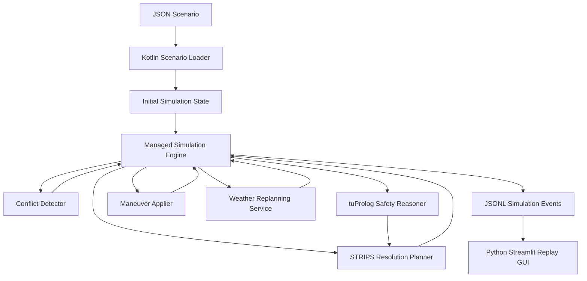

# AeroGuard-MAS Documentation

**AeroGuard-MAS** is a university software engineering project that implements a simulated multi-agent system for airspace conflict management.

The system models aircraft, routes, flight levels, weather zones, separation constraints, conflict detection, symbolic reasoning, planning, explanation, event logging, and replay visualization.

The project combines:

- a Kotlin simulation core;
- Jason / AgentSpeak(L) BDI agents;
- tuProlog symbolic reasoning;
- a small STRIPS-inspired planning layer;
- JSON scenarios;
- JSONL event logging;
- a Python Streamlit GUI for replay-based visualization;
- tests for prevent errors and validate behavior;
- automated tests and CI/CD through GitHub Actions.

## Documentation Structure

This documentation is organized as follows:

- [Abstract](abstract.md): project summary and objectives.
- [Domain](domain.md): airspace simulation domain and main concepts.
- [Design](design.md): architecture, components, and design rationale.
- [Tech Stack](tech-stack.md): technologies, tools, and runtime environment.
- [Code](code.md): important implementation details and intelligent behavior.
- [Testing](testing.md): testing strategy and validation scope.
- [Deployment](deployment.md): CI/CD pipeline and automation.
- [Conclusion](conclusion.md): results, limitations, and future work.

## Main Execution Flow

A typical AeroGuard-MAS run follows this flow:



## Example Commands
Run the full Kotlin test suite:
```bash
./gradlew test
```
Run a scenario and generate JSONL events:
```bash
./gradlew run --args="--scenario scenarios/simple_conflict.json --events build/aeroguard/events/simple_conflict_events.jsonl --explain"
```
Run the GUI to visualize the events:
```bash
cd gui
python -m venv .venv
.venv\Scripts\activate
pip install -r requirements.txt
streamlit run app.py
```
On windows:
```bash
cd gui
python -m venv .venv
.venv\Scripts\activate
pip install -r requirements.txt
streamlit run app.py
```

## Kotlin Docs

[Kotlin Docs are available here](https://alextesta00.github.io/aeroguard-mas/kdocs)
