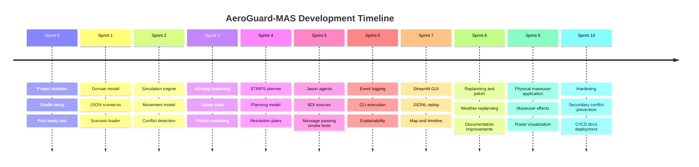
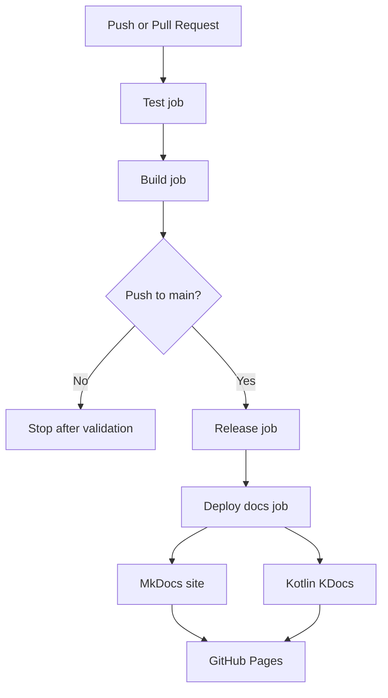
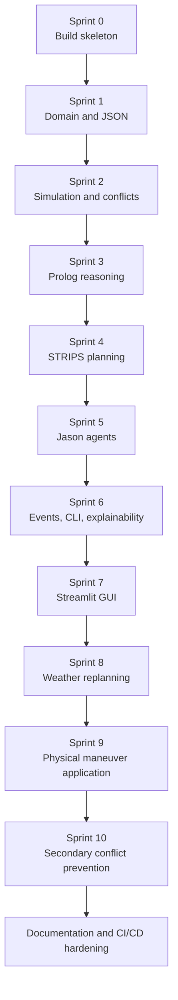

# Sprint History

This page documents the incremental development process followed during the implementation of **AeroGuard-MAS**.

The project was developed using a Scrum-inspired approach: each sprint introduced a small, testable, and demonstrable increment. The goal was to keep the system compilable and executable at every step, while progressively integrating simulation, symbolic reasoning, planning, agents, event logging, GUI visualization, documentation, and CI/CD.

## Sprint Overview



---

## Sprint 0 - Project Inception and Build Skeleton

### Sprint Goal

Create the initial project structure and make the repository buildable and testable from the beginning.

### Main Work

Sprint 0 established the technical foundation of the project:

- Gradle Kotlin DSL configuration.
- Kotlin JVM project setup.
- Initial package structure.
- Initial README and documentation folders.
- First sanity test.
- Basic CI-friendly project layout.

### Key Outputs

- `build.gradle.kts`
- `settings.gradle.kts`
- `README.md`
- `docs/`
- `src/main/kotlin/`
- `src/test/kotlin/`

### Engineering Value

This sprint ensured that the project had a stable base before adding domain or intelligent behavior. The most important result was that the project could be built and tested with:

```bash
./gradlew test
```

### Sprint Result

The project became compilable, executable through Gradle, and ready for incremental development.

---

## Sprint 1 - Domain Model and JSON Scenarios

### Sprint Goal

Introduce the core airspace domain model and load scenarios from JSON files.

### Main Work

Sprint 1 created the main domain concepts required by the simulation:

- aircraft;
- positions;
- flight levels;
- velocities;
- waypoints;
- routes;
- scenarios;
- separation configuration;
- weather zones;
- emergency state;
- aircraft priority.

A JSON scenario loader was introduced to convert scenario files into validated Kotlin domain objects.

### Key Outputs

Representative files:

- `src/main/kotlin/domain/Aircraft.kt`
- `src/main/kotlin/domain/Position.kt`
- `src/main/kotlin/domain/Route.kt`
- `src/main/kotlin/domain/Waypoint.kt`
- `src/main/kotlin/domain/Scenario.kt`
- `src/main/kotlin/domain/SimulationState.kt`
- `src/main/kotlin/integration/JsonScenarioLoader.kt`
- `scenarios/simple_conflict.json`
- `scenarios/no_conflict.json`

### Testing

Tests were added for:

- domain invariants;
- valid scenario parsing;
- invalid scenario rejection;
- route and waypoint validation.

### Engineering Value

This sprint created the vocabulary of the project. Later components such as simulation, reasoning, planning, and GUI all depend on these domain abstractions.

### Sprint Result

The system could load JSON scenarios into a strongly typed Kotlin model.

---

## Sprint 2 - Simulation and Conflict Detection

### Sprint Goal

Simulate aircraft movement over discrete ticks and detect current or future conflicts.

### Main Work

Sprint 2 introduced the simulation engine and conflict detection logic.

The simulation model supports:

- tick-by-tick advancement;
- movement toward active waypoints;
- Euclidean horizontal distance;
- vertical distance in feet;
- current conflict detection;
- predicted conflict detection over a configurable horizon.

### Key Outputs

Representative files:

- `src/main/kotlin/simulation/AircraftMover.kt`
- `src/main/kotlin/simulation/ConflictDetector.kt`
- `src/main/kotlin/simulation/SimulationEngine.kt`
- `src/main/kotlin/domain/Conflict.kt`
- `src/main/kotlin/domain/ConflictType.kt`

### Testing

Tests validated:

- aircraft movement;
- distance computation;
- current conflict detection;
- future conflict prediction;
- no false positives in safe scenarios.

### Execution

Example command:

```bash
./gradlew test
```

### Engineering Value

This sprint made the project demonstrable: aircraft could move and unsafe situations could be detected.

### Sprint Result

The simulation engine could detect both current and predicted losses of separation.

---

## Sprint 3 - tuProlog Safety Reasoner

### Sprint Goal

Introduce symbolic reasoning for safety, priorities, and maneuver feasibility.

### Main Work

Sprint 3 added a Prolog-based reasoning layer through tuProlog.

The Kotlin core communicates with Prolog through the `SafetyReasoner` interface. The implementation translates the current simulation state into Prolog facts and queries symbolic rules.

The Prolog theory includes rules for:

- unsafe aircraft pairs;
- minimum horizontal separation;
- minimum vertical separation;
- priority reasoning;
- emergency priority;
- low fuel priority;
- maneuver feasibility;
- explanation facts.

### Key Outputs

Representative files:

- `src/main/kotlin/reasoning/SafetyReasoner.kt`
- `src/main/kotlin/reasoning/TuPrologSafetyReasoner.kt`
- `src/main/kotlin/reasoning/ReasoningException.kt`
- `src/main/prolog/airspace_rules.pl`

### Testing

Tests validated:

- priority scores;
- emergency priority;
- unsafe conflict reasoning;
- maneuver allowed / rejected decisions;
- explanation query behavior.

### Engineering Value

This sprint separated declarative safety knowledge from imperative simulation logic. Prolog rules became inspectable, testable, and independently evolvable.

### Sprint Result

The system could reason symbolically about airspace safety and aircraft priority.

---

## Sprint 4 - STRIPS Resolution Planner

### Sprint Goal

Generate corrective plans for conflicts using a small STRIPS-style planner.

### Main Work

Sprint 4 introduced automated planning.

The planning layer models:

- propositions;
- actions;
- preconditions;
- add effects;
- delete effects;
- initial state;
- goal state.

A bounded breadth-first search planner was implemented. A resolution planner maps aircraft conflicts to candidate maneuvers such as climb, descend, or slow down.

### Key Outputs

Representative files:

- `src/main/kotlin/planning/Proposition.kt`
- `src/main/kotlin/planning/StripsAction.kt`
- `src/main/kotlin/planning/StripsProblem.kt`
- `src/main/kotlin/planning/StripsPlanner.kt`
- `src/main/kotlin/planning/ResolutionPlanner.kt`
- `src/main/kotlin/planning/StripsResolutionPlanner.kt`
- `src/main/kotlin/planning/ManeuverFormatting.kt`

### Testing

Tests validated:

- STRIPS action application;
- precondition handling;
- add and delete effects;
- valid plan discovery;
- invalid plan rejection;
- conflict resolution plan generation.

### Engineering Value

This sprint introduced explicit automated decision-making. The system no longer only detected conflicts; it could propose resolution plans.

### Sprint Result

The project gained a working planning layer capable of producing corrective maneuvers.

---

## Sprint 5 - Jason Agents Integration

### Sprint Goal

Introduce real Jason / AgentSpeak(L) agents and validate BDI concepts.

### Main Work

Sprint 5 added AgentSpeak source files for the main conceptual agents:

- aircraft agent;
- sector controller;
- conflict detector;
- resolution planner;
- explanation agent.

The agents express:

- beliefs;
- goals;
- intentions;
- plans;
- message passing;
- delegation through `.send(...)`.

A lightweight Kotlin smoke analyzer validates that the `.asl` files exist and contain BDI-oriented structures.

### Key Outputs

Representative files:

- `src/main/agents/aircraft.asl`
- `src/main/agents/sector_controller.asl`
- `src/main/agents/conflict_detector.asl`
- `src/main/agents/resolution_planner.asl`
- `src/main/agents/explanation_agent.asl`
- `src/main/kotlin/integration/JasonAgentCatalog.kt`
- `src/main/kotlin/integration/JasonAgentSmokeAnalyzer.kt`
- `src/main/kotlin/integration/JasonSmokeReport.kt`
- `src/main/kotlin/integration/JasonSmoke.kt`

### Testing

Tests validated:

- required agent files are present;
- BDI concepts are extractable;
- message passing exists;
- achieve messages exist;
- smoke report passes.

### Engineering Value

This sprint ensured that the multi-agent aspect of the project was not only described in documentation but represented by real AgentSpeak files.

### Sprint Result

The system gained real BDI agent artifacts and CI-friendly agent validation.

---

## Sprint 6 - Event Logging, CLI, and Explainability

### Sprint Goal

Make the system executable from the command line and observable through structured JSONL events.

### Main Work

Sprint 6 introduced:

- CLI scenario execution;
- JSONL event logging;
- event sinks;
- explanation events;
- plan and maneuver events;
- conflict events;
- belief update events.

The CLI can load a scenario, run the managed simulation, print a summary, and write JSONL events for the GUI.

### Key Outputs

Representative files:

- `src/main/kotlin/cli/AeroGuardCli.kt`
- `src/main/kotlin/events/SimulationEvent.kt`
- `src/main/kotlin/events/SimulationEventSink.kt`
- `src/main/kotlin/events/JsonlSimulationEventSink.kt`
- `src/main/kotlin/events/ConsoleSimulationEventSink.kt`
- `src/main/kotlin/events/CompositeSimulationEventSink.kt`
- `src/main/kotlin/events/SimulationEventRecorder.kt`
- `src/main/kotlin/events/SimulationEventJson.kt`
- `src/main/kotlin/explanation/ExplanationService.kt`
- `src/main/kotlin/explanation/DecisionExplanation.kt`

### Testing

Tests validated:

- event serialization;
- JSONL output;
- CLI smoke execution;
- explanation generation;
- event fields required by the GUI.

### Execution

Example command:

```bash
./gradlew run --args="--scenario scenarios/simple_conflict.json --events build/aeroguard/events/simple_conflict_events.jsonl --explain"
```

### Engineering Value

This sprint made the internal behavior observable. Instead of only seeing final states, users can inspect aircraft states, conflicts, plans, maneuvers, beliefs, and explanations.

### Sprint Result

The project became executable as a CLI demo and produced structured event logs.

---

## Sprint 7 - Python Streamlit GUI Visualizer

### Sprint Goal

Create a separate Python GUI that replays JSONL events generated by the Kotlin core.

### Main Work

Sprint 7 introduced a replay-based GUI using Streamlit.

The GUI supports:

- loading sample or uploaded JSONL files;
- validating event structure;
- selecting simulation ticks with a slider;
- visualizing aircraft positions;
- showing conflicts;
- showing maneuvers;
- displaying event timelines;
- displaying agent beliefs and inferred intentions;
- displaying explanations;
- showing raw events.

### Key Outputs

Representative files:

- `gui/app.py`
- `gui/validate_events.py`
- `gui/requirements.txt`
- `gui/README.md`
- `gui/sample_events/`

### Testing

The GUI validation logic checks:

- required fields for each event type;
- malformed JSONL files;
- invalid ticks;
- invalid event payloads;
- route snapshot format;
- aircraft state format.

### Execution

Linux/macOS:

```bash
cd gui
python -m venv .venv
source .venv/bin/activate
pip install -r requirements.txt
streamlit run app.py
```

Windows:

```powershell
cd gui
python -m venv .venv
.venv\Scripts\activate
pip install -r requirements.txt
streamlit run app.py
```

### Engineering Value

The GUI made the system suitable for an exam demo. It clearly separates intelligent decision-making from visualization.

### Sprint Result

The project gained an interactive replay viewer for simulation behavior.

---

## Sprint 8 - Replanning and Exam Polish

### Sprint Goal

Add dynamic replanning behavior and improve the project for demonstration.

### Main Work

Sprint 8 focused on dynamic scenarios, especially weather replanning.

The system gained support for:

- weather zone activation events;
- detecting route intersection with active weather zones;
- generating weather replanning decisions;
- producing weather-related JSONL events;
- explaining weather replanning.

Documentation and demo-readiness were also improved.

### Key Outputs

Representative files:

- `src/main/kotlin/replanning/WeatherReplanningService.kt`
- `scenarios/weather_replanning.json`
- additional explanation events;
- updated GUI validation for weather events.

### Testing

Tests validated:

- weather activation;
- replanning decision generation;
- route intersection detection;
- JSONL event generation;
- GUI handling of weather-zone events.

### Engineering Value

This sprint made the simulation dynamic. The world is no longer static: events can occur during the run and require a new plan.

### Sprint Result

The project could respond to active weather zones with replanning decisions and explanations.

---

## Sprint 9 - Physical Maneuver Application and Route Visualization

### Sprint Goal

Ensure that selected maneuvers physically affect the simulation state and are visible in the GUI.

### Main Work

Before this sprint, plans could be generated and logged, but some effects were not fully reflected in future aircraft states. Sprint 9 closed that gap.

The sprint introduced or refined:

- physical climb and descend application;
- speed changes;
- reroute application;
- scheduled maneuvers;
- managed simulation loop;
- route snapshots;
- waypoint visualization;
- aircraft trails in the GUI;
- airplane-shaped symbols instead of simple points;
- improved altitude and vertical separation charts.

### Key Outputs

Representative files:

- `src/main/kotlin/simulation/ManeuverApplier.kt`
- `src/main/kotlin/simulation/ScheduledManeuver.kt`
- `src/main/kotlin/simulation/ManagedSimulationEngine.kt`
- `src/main/kotlin/events/RouteSnapshotEvent`
- `gui/app.py`
- `gui/validate_events.py`

### Testing

Tests validated:

- climb changes altitude;
- descend changes altitude;
- slow down changes speed;
- reroute changes the aircraft route;
- managed simulation applies planned maneuvers;
- generated JSONL reflects post-maneuver states;
- weather rerouting changes aircraft trajectory.

### Engineering Value

This sprint was critical because it ensured that decisions are not only logged but actually change the simulated world.

### Sprint Result

The GUI can visually show that aircraft follow updated routes and that maneuvers are physically applied.

---

## Sprint 10 - Secondary Conflict Prevention and Hardening

### Sprint Goal

Prevent resolution plans from creating new conflicts with third aircraft.

### Main Work

This sprint addressed a realistic planning issue: a maneuver may solve a primary conflict while creating a secondary conflict.

The system was extended with a secondary-conflict-aware planner. It:

1. generates candidate maneuvers;
2. checks them with the symbolic reasoner;
3. applies each candidate in a simulated future state;
4. advances the simulation over a prediction horizon;
5. rejects maneuvers that create new conflicts;
6. selects the first safe maneuver.

### Key Outputs

Representative files:

- `src/main/kotlin/planning/SecondaryConflictAwareResolutionPlanner.kt`
- updated `src/main/kotlin/simulation/ManagedSimulationEngine.kt`
- `scenarios/secondary_conflict.json`

### Testing

Tests validated that:

- unsafe maneuvers are rejected;
- a climb that creates a conflict with another aircraft is not selected;
- a safer descend maneuver can be selected instead;
- managed simulation does not produce the expected secondary conflict after prevention.

### Engineering Value

This sprint made the planning layer more intelligent. It introduced consequence checking instead of relying only on local conflict resolution.

### Sprint Result

The system can reject resolution plans that create secondary conflicts.

---

## Documentation and CI/CD Hardening

### Goal

Improve project maintainability, presentation quality, and automated delivery.

### Main Work

After the main feature sprints, the project was polished with:

- KDoc documentation for Kotlin files;
- Python docstrings for the GUI;
- MkDocs documentation website;
- Mermaid diagrams;
- GitHub Actions improvements;
- Dokka KDocs generation;
- documentation deployment planning.

### Key Outputs

Representative files:

- `mkdocs.yml`
- `requirements-docs.txt`
- `docs/index.md`
- `docs/abstract.md`
- `docs/domain.md`
- `docs/design.md`
- `docs/tech-stack.md`
- `docs/code.md`
- `docs/testing.md`
- `docs/deployment.md`
- `docs/conclusion.md`
- `.github/workflows/ci.yml`

### CI/CD Flow



### Engineering Value

This work improved the professional quality of the repository. The project became easier to review, present, test, and maintain.

---

## Final Sprint Summary



## Overall Result

Across the sprints, AeroGuard-MAS evolved from an empty Gradle project into a complete intelligent-system prototype.

The final project includes:

- a Kotlin simulation core;
- a typed domain model;
- JSON scenario loading;
- current and predicted conflict detection;
- tuProlog symbolic reasoning;
- STRIPS-style planning;
- secondary conflict prevention;
- Jason BDI agents;
- weather replanning;
- physical maneuver application;
- JSONL observability;
- CLI execution;
- Python Streamlit GUI replay;
- automated tests;
- CI/CD;
- MkDocs and KDocs documentation.

The most important architectural achievement is that the system remains modular: detection, reasoning, planning, simulation, logging, and visualization are separate concerns connected through explicit interfaces and structured data.
