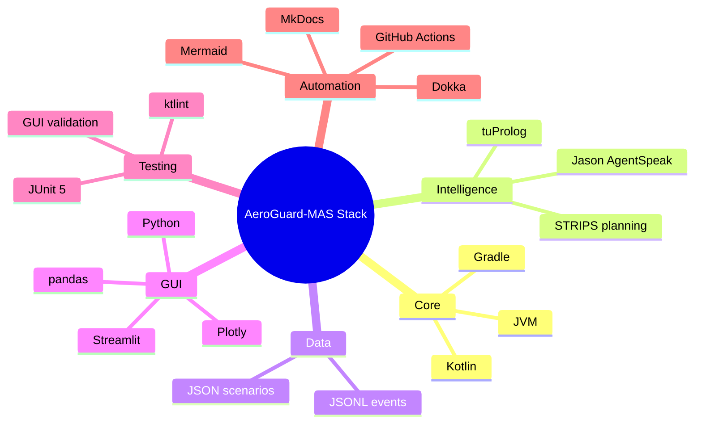

# Tech Stack

## Overview

AeroGuard-MAS combines JVM, logic programming, agent programming, and Python visualization technologies. The stack was chosen to support intelligent-system engineering while keeping the project executable from the command line and testable through CI.

## Technology Map



## Kotlin

Kotlin is the main implementation language. It is used for:

- the domain model;
- scenario loading;
- simulation;
- conflict detection;
- planning;
- reasoning integration;
- event generation;
- CLI execution;
- tests.

Kotlin is suitable because it provides strong typing, data classes, null-safety, concise syntax, and good interoperability with JVM libraries.

## Gradle

Gradle with Kotlin DSL is used as the build system. It manages:

- dependencies;
- compilation;
- tests;
- application execution;
- custom tasks such as Jason smoke execution;
- CI build commands.

The project uses the Gradle wrapper, so developers and CI runners can execute the build consistently.

## Jason / AgentSpeak(L)

Jason is used to represent BDI agents. The project includes real `.asl` files for agents such as:

- aircraft agent;
- sector controller;
- conflict detector;
- resolution planner;
- explanation agent.

The current integration validates these files through smoke analysis, checking that they expose BDI concepts and message passing.

Jason is used because the project explicitly targets multi-agent BDI modeling.

## tuProlog

tuProlog provides the symbolic reasoning layer. Kotlin communicates with this layer through a `SafetyReasoner` interface.

tuProlog is used for:

- safety rules;
- priority reasoning;
- maneuver feasibility;
- symbolic explanation facts.

The Prolog theory is stored as a real project resource, making the symbolic logic inspectable and versioned.

## JSON

JSON is used for input scenarios. Scenario files define:

- aircraft;
- routes;
- positions;
- altitudes;
- speeds;
- priorities;
- separation thresholds;
- weather zones;
- dynamic events.

JSON was chosen because it is human-readable, easy to version, and simple to load from Kotlin.

## JSONL

JSONL is used for simulation event logs. Each line represents one event, such as:

```json
{"tick":0,"type":"aircraft_state","aircraft":"AZA123","x":0.0,"y":0.0}
```

JSONL is useful because it is:

- stream-friendly;
- easy to parse in Python;
- easy to inspect manually;
- suitable for replay-based visualization.

## Python

Python is used for the GUI. It is separate from the core and acts only as a viewer.

## Streamlit

Streamlit provides the web-based replay GUI. It was chosen because it allows quick development of an interactive demo with:

- file upload;
- tick slider;
- charts;
- tables;
- layout panels;
- explanations.

## pandas

pandas is used to load, group, filter, and transform JSONL events in the GUI.

## Plotly

Plotly is used for interactive visualizations, including:

- aircraft map;
- trails;
- routes and waypoints;
- altitude profiles;
- vertical separation profiles;
- event timelines.

## JUnit 5

JUnit 5 is used for automated testing. Tests validate the domain model, parsing, simulation, reasoning, planning, event serialization, CLI behavior, and agent-source smoke checks.

## ktlint

ktlint is used to enforce Kotlin formatting and style. This helps maintain consistency as the project grows.

## Dokka

Dokka is used for Kotlin API documentation generation. The generated documentation can be published as project KDocs through GitHub Pages.

## MkDocs and Mermaid

MkDocs is used to generate the project documentation website. Mermaid diagrams are used to describe architecture, execution flows, testing, and deployment directly inside Markdown files.

## GitHub Actions

GitHub Actions is used for CI/CD. The workflow runs tests and builds on:

- Ubuntu;
- Windows;
- macOS.

The release job is configured for the `main` branch and can generate documentation and publish artifacts.

## Node.js and npm

Node.js and npm are used in the release job. The workflow runs `npm ci` and `npm run release`, which suggests a release automation tool such as semantic-release is expected.

## Runtime Environment

The Kotlin core runs on the JVM. The CI configuration uses Java 25 through Temurin.

The GUI runs in a Python virtual environment with dependencies installed from `gui/requirements.txt`.

## Why This Stack Fits the Project

The project is intentionally multi-paradigm:

- Kotlin provides engineering structure.
- Jason provides BDI agent modeling.
- Prolog provides declarative symbolic reasoning.
- STRIPS-style planning provides automated decision generation.
- JSON/JSONL provide reproducible data exchange.
- Python/Streamlit provide demonstration and observability.
- Gradle and GitHub Actions provide repeatable build and validation.
- MkDocs and Mermaid provide maintainable project documentation.
