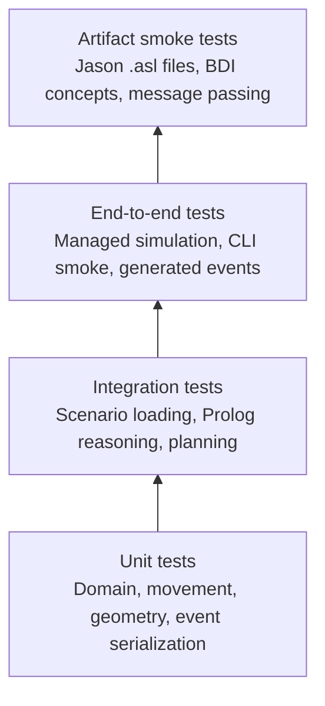
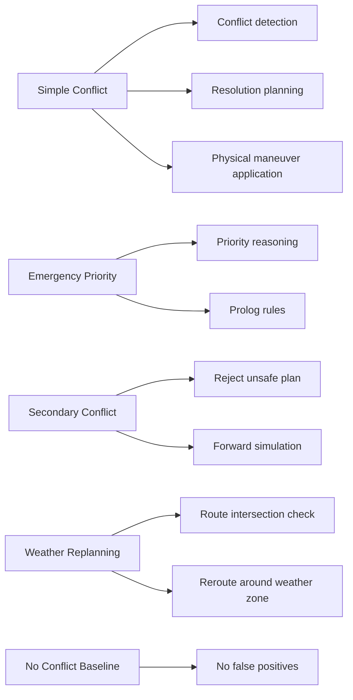

# Testing

## Overview

AeroGuard-MAS uses automated tests to validate the correctness of the domain model, scenario loading, simulation, reasoning, planning, event serialization, Jason source integration, and GUI event parsing.

The primary test framework is JUnit 5 for Kotlin. The Python GUI includes validation logic that can be tested with Python tooling.

## Testing Pyramid



## What Is Tested

The testing strategy covers several layers.

### Domain Tests

Domain tests validate invariants such as:

- aircraft identifiers must not be blank;
- routes must contain at least one waypoint;
- route waypoint names must be unique;
- flight levels must be non-negative;
- velocities must be finite and non-negative;
- separation thresholds must be positive.

These tests protect the foundation of the simulation.

### Scenario Loading Tests

Scenario loader tests verify that JSON scenarios are parsed correctly into domain objects.

They validate:

- aircraft fields;
- routes and waypoints;
- separation configuration;
- priorities;
- emergency values;
- weather zones;
- dynamic events.

They also verify error handling for invalid data.

### Distance and Movement Tests

Simulation tests validate:

- Euclidean distance computation;
- step-wise movement toward waypoints;
- stopping at waypoints;
- tick advancement;
- aircraft state updates.

### Conflict Detection Tests

Conflict detection tests verify:

- current horizontal and vertical separation losses;
- predicted conflicts over a horizon;
- no false positives in no-conflict scenarios;
- conflict identity and involved aircraft.

### Reasoning Tests

tuProlog reasoner tests validate symbolic behavior such as:

- unsafe conflict evaluation;
- maneuver feasibility;
- aircraft priority;
- emergency or low-fuel priority;
- explanation facts.

These tests ensure that Prolog rules are not only present but also used by Kotlin.

### Planning Tests

Planning tests validate:

- STRIPS action application;
- goal satisfaction;
- valid plan discovery;
- invalid plan rejection;
- resolution-plan generation.

The secondary-conflict-aware planner is tested to ensure that it rejects maneuvers that create additional conflicts.

### Maneuver Application Tests

`ManeuverApplier` tests validate physical effects:

- climb changes altitude;
- descend changes altitude;
- slow down reduces speed;
- reroute changes the active route;
- unsupported or symbolic maneuvers do not corrupt state.

### Managed Simulation Tests

Managed simulation tests validate the integrated loop:

```text
detect conflict
    -> generate plan
    -> schedule maneuver
    -> apply maneuver
    -> continue simulation
```

Important assertions include:

- generated plans are not null when a conflict exists;
- maneuvers are applied to future states;
- simple conflicts are resolved;
- secondary conflicts are prevented;
- weather replanning changes routes.

### Event Serialization Tests

Event tests validate:

- JSONL structure;
- required fields;
- correct serialization of lists;
- route snapshot events;
- maneuver selected events;
- explanation events.

This is important because the GUI depends on a stable event contract.

### Jason Smoke Tests

Jason integration tests validate that required `.asl` files exist and expose:

- beliefs;
- goals;
- intentions;
- message passing;
- achieve messages.

This is a lightweight but stable way to verify BDI artifacts in CI.

### CLI Smoke Tests

CLI tests validate that the command-line application can run scenarios and produce expected output or events.

### GUI Validation Tests

The GUI includes JSONL validation logic. It checks:

- required fields by event type;
- valid tick values;
- valid aircraft state events;
- valid conflict events;
- valid weather-zone events;
- valid route snapshot events.

## Scenario Validation Matrix



## Test Structure

Tests are organized under:

```text
src/test/kotlin
```

Python GUI tests, where present, are expected under the GUI folder. Exact Python test file names are **To be completed** if the repository does not currently include them.

## Running Tests

Run all Kotlin tests:

```bash
./gradlew test
```

Run the full build:

```bash
./gradlew build
```

Run Jason smoke check:

```bash
./gradlew runJasonSmoke
```

Run GUI tests if configured:

```bash
cd gui
python -m pytest
```

## Important Test Scenarios

### Simple Conflict

Two aircraft converge toward the same point at the same altitude. The system should detect a predicted conflict and generate a corrective maneuver.

### Emergency Priority

One aircraft has higher priority because of emergency or low-fuel status. The system should prefer maneuvering the lower-priority aircraft.

### Secondary Conflict

A naive maneuver would solve the primary conflict but create a new conflict with a third aircraft. The secondary-conflict-aware planner must reject the unsafe maneuver.

### Weather Replanning

A weather zone becomes active along an aircraft route. The system must reroute the aircraft around the zone and the GUI should show the changed path.

### No Conflict Baseline

Aircraft remain safely separated. The system should not generate false positives.

## CI Testing

The GitHub Actions workflow runs tests on multiple operating systems:

- Ubuntu;
- Windows;
- macOS.

This validates that the project is not accidentally tied to one platform.

## Limitations

The testing strategy is strong for a university project but has limitations:

- no property-based testing yet;
- no performance testing;
- no large-scale scenario suite;
- no real Jason runtime integration test;
- no formal verification of Prolog rules;
- GUI tests are focused on parsing/validation rather than full browser automation;
- aviation realism is not tested because the model is intentionally simplified.

## Future Testing Improvements

Possible improvements include:

- property-based tests for geometry and separation;
- golden-file tests for JSONL event output;
- end-to-end tests that compare generated events with expected replay behavior;
- stricter Prolog predicate tests;
- Playwright or Selenium tests for the Streamlit GUI;
- mutation testing for planner and conflict detector logic;
- test coverage reports in CI.
